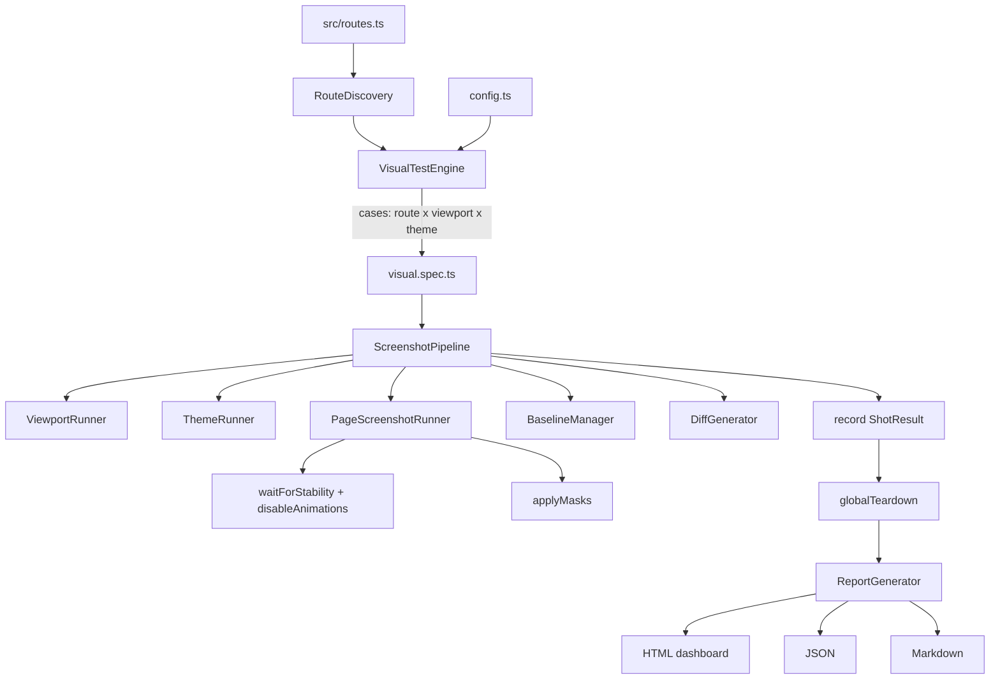

# Visual Regression Framework — Architecture

Cross-platform automated screenshot testing for the Vestara Workspace UI
(Playwright, TypeScript, Vite). The framework discovers application routes
from the single source of truth (`src/routes.ts`), captures them across
configurable viewport + theme matrices, compares against approved baselines,
and produces HTML / JSON / Markdown reports that gate CI.

## Pipeline



## Modules (single responsibility)

| Module | Responsibility |
|--------|----------------|
| `config.ts` | viewports, themes, tolerance, mode, output layout (env-driven) |
| `routes/manifest.ts` | derives typed `RouteDefinition[]` from `src/routes.ts` |
| `routes/discovery.ts` | applies policy filters (hidden/admin/dev/disabled) + env route filter |
| `helpers/naming.ts` | deterministic `Title.viewport.theme.png` filenames + shot keys |
| `helpers/stability.ts` | waits for fonts/settle, disables animations/transitions/cursors |
| `helpers/masks.ts` | paints over dynamic regions (charts, toasts, live counters) |
| `helpers/theme.ts` | seeds the `vestara-theme` localStorage key before navigation |
| `auth/roles.ts` | role identities + Playwright storage-state files |
| `baselines/manager.ts` | baseline/current/diff path resolution + missing detection |
| `diff/generator.ts` | pixelmatch + pngjs comparison → diff %, pass/fail |
| `reports/generator.ts` | HTML dashboard, JSON, Markdown summary |
| `runner/page.ts` | open route → stabilize → mask → capture buffer |
| `runner/viewport.ts` | isolated browser context sized for a viewport |
| `runner/theme.ts` | theme selection + init-script seeding |
| `pipeline.ts` | compose viewport → theme → capture → compare |
| `engine.ts` | case generation, execution, result recording |
| `visual.spec.ts` | Playwright entry: one test per case |
| `setup-clean.ts` / `report-teardown.ts` | clear artifacts; aggregate report |

## Directory structure

```
apps/workspace/tests/visual/
├── config.ts                 framework configuration
├── engine.ts                 VisualTestEngine
├── pipeline.ts               ScreenshotPipeline
├── visual.spec.ts            Playwright entry
├── playwright.config.ts      (at apps/workspace root)
├── auth/ roles.ts            roles + storage state
├── baselines/ manager.ts
├── diff/ generator.ts
├── helpers/ naming · stability · masks · theme
├── reports/ generator.ts
├── routes/ manifest · discovery
├── runner/ page · viewport · theme
├── scripts/ clean · report
├── __tests__/                unit + integration tests
├── .artifacts/               generated (gitignored except baselines)
│   ├── baselines/            approved baselines (committed)
│   ├── current/ diff/ reports/ results/   (gitignored)
└── docs/                     this documentation
```

## Route discovery

`src/routes.ts` is the single source of truth. Each route carries `id`, `path`,
`title`, `requiresAuth`, `enabled`, `layout`, optional `sampleParams` for
dynamic paths. `RouteDiscovery` converts them to concrete `RouteDefinition`s
(resolving `:params`), applies policy filters (`HIDDEN_ROUTES`,
`ADMIN_ROUTES`, `DEV_ROUTES`, disabled routes), and supports `SCREENSHOT_ROUTES`
env filtering for targeted runs.

## Comparison & reporting

- Update mode (`screenshots:update`): writes baselines, no assertions.
- Compare mode: writes `current`, and if a baseline exists runs pixelmatch
  (configurable `tolerance`, `maxDiffPercent`); missing baselines fail the run
  until approved.
- `globalTeardown` aggregates per-worker results into
  `reports/visual-regression.{json,md,html}`.

## Dependencies

`@playwright/test`, `pixelmatch`, `pngjs` (+ `@types/pngjs`), `tsx`.

## CI

`.github/workflows/visual-regression.yml`: install → build UI → install
browsers → `screenshots:ci` → upload report artifact → comment on PR → fail on
regression.
